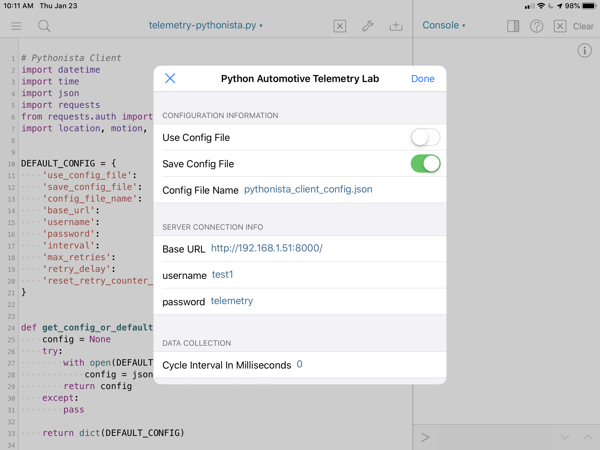
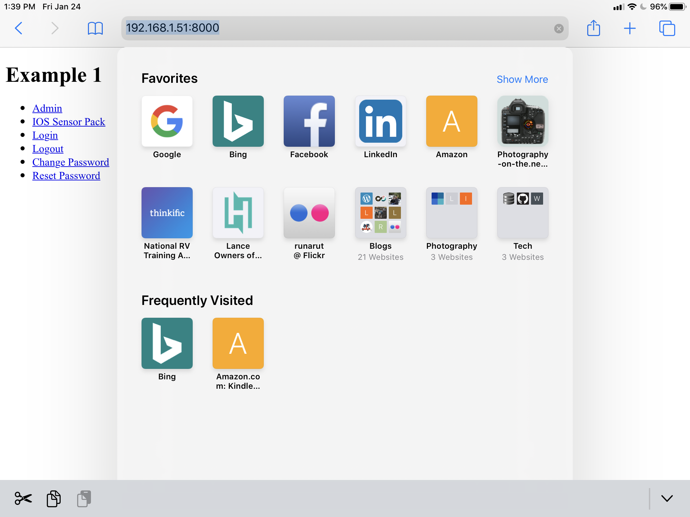
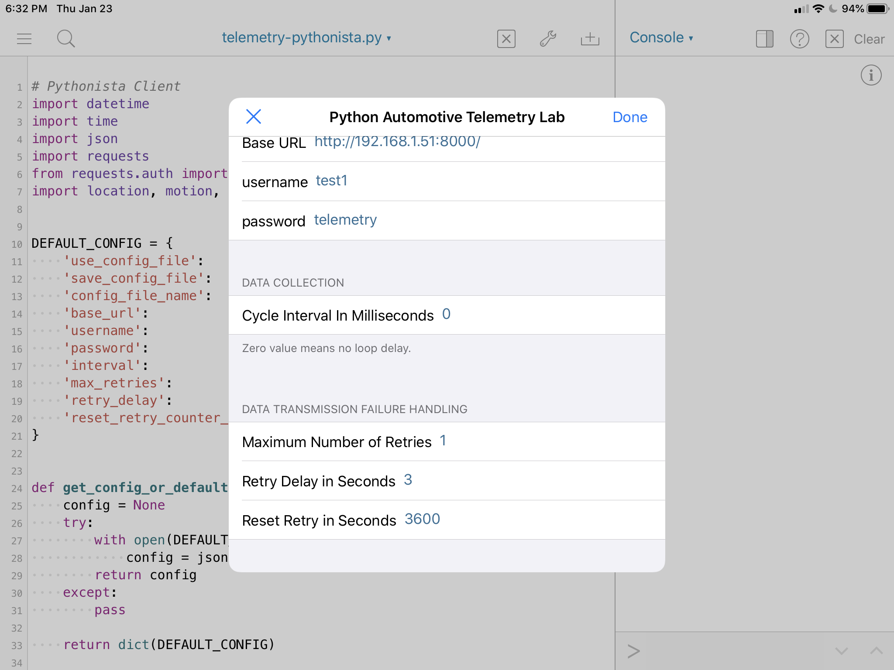

# telemetry-pythonista

## Python REST Client Written for IOS Pythonista To Send Location And Motion Data To Server

Python REST client sends location and motion data to a Django server REST interface on a different computer.  The Pythonista Python 3.8 implementation supports IOS specific Python modules ```location```, ```motion``` and ```dialogs```.  

A companion repository ([Telemetry Django Server](https://github.com/thatlarrypearson/telemetry-django-server)) contains the server code providing the REST interface used by this client code.

## Pythonista

[Pythonista 3](https://apps.apple.com/us/app/pythonista-3/id1085978097) is an Apple IOS application that runs on iPhones and iPads.   The Pythonista app makes Python 3.6 available on iPhones and iPads.  

## Running Client Program On Pythonista

On my version of Pythonista, ```git``` doesn't appear to be working.  To get the code into Pythonista, I've been using the Safari browser on my iPad and getting the code off of the github repository.  

Start on the [telemetry-pythonista](https://github.com/thatlarrypearson/telemetry-pythonista) repository page.  Look for the [```src``` directory](https://github.com/thatlarrypearson/telemetry-pythonista/tree/master/src) link and click on it.  In the ```src``` directory you will see the [```pythonista_client.py```](https://github.com/thatlarrypearson/telemetry-pythonista/blob/master/src/pythonista_client.py) directory.  Click on that link.  Just above the source code listing will be a button labeled [**Raw**](https://raw.githubusercontent.com/thatlarrypearson/telemetry-pythonista/master/src/pythonista_client.py).  Click on that link.

Copy all of the text on the **Raw** ```pythonista_client.py``` web page and paste into a blank file in the Pythonista app.  Run the script.

## Pythonista Client Configuration

The configuration dialog box is divided into sections.



### Configuration Information

This configuration section has configuration management information.

#### Use Config File

When switched on, the application will not show this dialog on startup.  Instead, the application will start and run with the configuration as stored in the ```pythonista_client_config.json``` file.  By default, the application displays the configuration dialog on startup.

#### Save Config File

When switched on, the application will save the runtime configuration to a file.  By default, the configuration gets saved to a file.

#### Config File Name

The configuration will be saved to this file name when ```Save Config File``` is switched on.  However, only the ```pythonista_client_config.json``` will be used on startup.  While a config file can be saved to a different file, only the default ```pythonista_client_config.json``` file can be used on startup.   The configuration file format is JSON as shown below.

```JSON
{"use_config_file": false, "save_config_file": true, "config_file_name": "pythonista_client_config.json", "base_url": "http://192.168.1.51:8000/", "username": "test1", "password": "telemetry", "interval": "0", "max_retries": "1", "retry_delay": "3", "reset_retry_counter_duration": "3600"}
```

### Server Connection Info

This configuration section manages the connection information needed to interact with the web server.

#### Base URL

The base URL for the web server can be of the form "```http://192.168.1.51:8000/```", "```http://192.168.1.51/```", "```http://hostname.com:8000/```" or "```http://hostname.com/```" depending on how the server is known on your network.  An example is shown below.



#### username

Username represents an account name that can be used to access the server's web application.  Since usernames are publically visible to other logged in users on the server, a password will also need to be used to gain access to the server application.

#### password

Passwords are secrets that are only known between the user (you and/or your iPad/iPhone) and the server.

### Data Collection

This section covers configuration information related to the collected information and how often that information is collected.

#### Cycle Interval In Milliseconds

The client software is currently implemented around a loop that runs over and over forever unless some network error causes it to fail.  The delay between the end of a loop and the start of the next one is the ```Cycle Interval```.  The ```Cycle Interval``` is expressed in milliseconds.  Each millisecond is 1/1,000 of a second.  When the value is 0, there is no delay and the end of one cycle is the beginning of the next cycle.

### Data Transmission Failure Handling

In a network environment, connection failures are a certanty.  The client is designed to be somewhat resilient to network and server failures.  The configuration information below informs how the failures are dealt with and when the client program should just give up and end.



#### Maximum Number of Retries

The maximum number of retries before the client application ends.  The internal retry counter will reset to zero when the time between the last retry exceeds the number of seconds in the ```Reset Retry``` timer.

#### Retry Delay in Seconds

When an error occurs, the client will stop cycling for the ```Retry Delay``` number of seconds.  This helps avoids issues with radio/radar noise interfering with the network/WIFI signals.  No data is collected during this timeout period.

#### Reset Retry in Seconds

Starting at the last network error causing a retry, if no errors occur within the ```Reset Retry``` interval, then the retry counter is set to 0.
